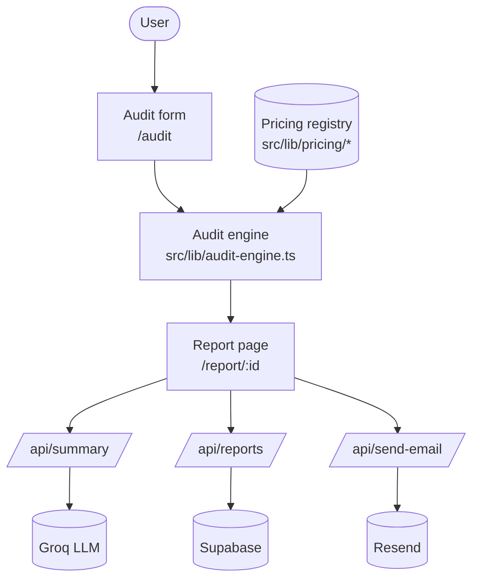

# Architecture

## Data flow: 

1. **User fills the form at `/audit`.** Each step's input is kept in React state and mirrored to `localStorage` so a refresh doesn't lose progress.
2. **On submit**, the form bundles tools, plans, seats, team size, and billing cycle into one `auditData` object. It generates a `reportId` and `shareToken`, writes the bundle to `sessionStorage`, and POSTs it to `/api/reports`, which stores it in Supabase.
3. **The browser is redirected to `/report/:id?share=…`**.
4. **The report page reads the bundle** from `sessionStorage` if present, otherwise fetches it from Supabase using the share token.
5. **`runAudit(input)` runs in the browser** (`src/lib/audit-engine.ts`). It joins the user's tools against the pricing registry, applies 7 rules (overlap, oversized plans, monthly-vs-annual, unused seats, etc.), and returns recommendations, totals, and an optimization score.
6. **The report renders.** From there it makes two optional calls: `/api/summary` (Groq) for the narrative, and `/api/send-email` (Resend) if the user emails the report.

## Why this stack

- **Next.js 16 + App Router** — one project for the marketing site, the form, the report pages, and the API routes. No separate backend to deploy.
- **TypeScript** — the audit engine is a lot of branching over plan shapes. Types catch most of the bugs before runtime.
- **Tailwind + Framer Motion** — fast to iterate on a marketing-heavy UI without writing CSS files.
- **Supabase** — Postgres + an HTTP client. Enough for storing reports and looking them up by share token, no ORM needed.
- **Groq** — fast LLM inference. The narrative summary should feel instant, and Groq is the only provider that hits sub-second on small Llama models.
- **Resend** — simple transactional email API. No DNS gymnastics, no SES setup.
- **Vitest** — runs the audit-engine tests in under a second. No Jest/Babel config.

## What I'd change for 10k audits/day

At 10k/day (~7/minute average, bursty), the current setup will start to feel the seams in a few places:

- **Rate limit the API routes.** `src/lib/rate-limit.ts` exists but should be enforced on `/api/reports`, `/api/summary`, and `/api/send-email` to keep one bad actor from burning the Groq/Resend budgets.
- **Cache the LLM summary.** Today every report view that calls `/api/summary` regenerates the narrative. Hash the audit input and cache the summary keyed by hash — most re-shares of a report are the same input.
- **Queue the emails.** `/api/send-email` runs inline today. At burst load this blocks the request. Push to a queue (e.g. Supabase Edge Function, Upstash QStash, or a simple Postgres-backed job table) and return immediately.
- **Move audit storage off the user's session.** Right now the report bundle lives in `sessionStorage` for the submitting user, with Supabase as the fallback for shares. At scale, Supabase should be the only source of truth so reports survive across devices.
- **Pricing freshness.** `src/lib/pricing/*.ts` is hand-maintained. A nightly job that diffs each vendor's pricing page and opens a PR would catch silent price changes that quietly skew every recommendation.
- **Observability.** Add Sentry (or similar) for API errors. With 10k audits/day, a 0.1% error rate is 10 broken reports — invisible without it.
- **CDN/edge cache static reports.** A finished report at `/report/:id` is immutable once written. Cache the HTML at the edge with a long TTL keyed by `id+shareToken`.
