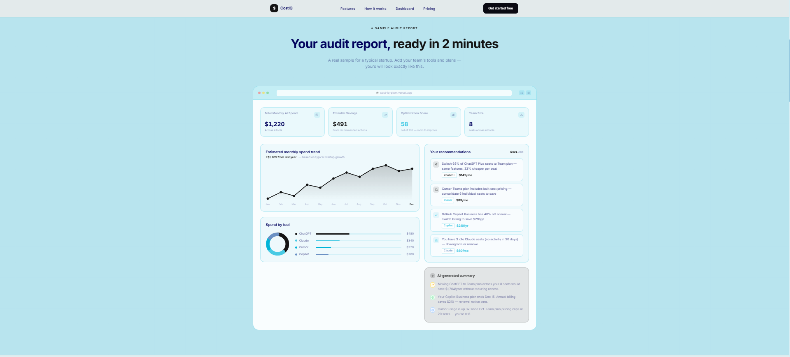
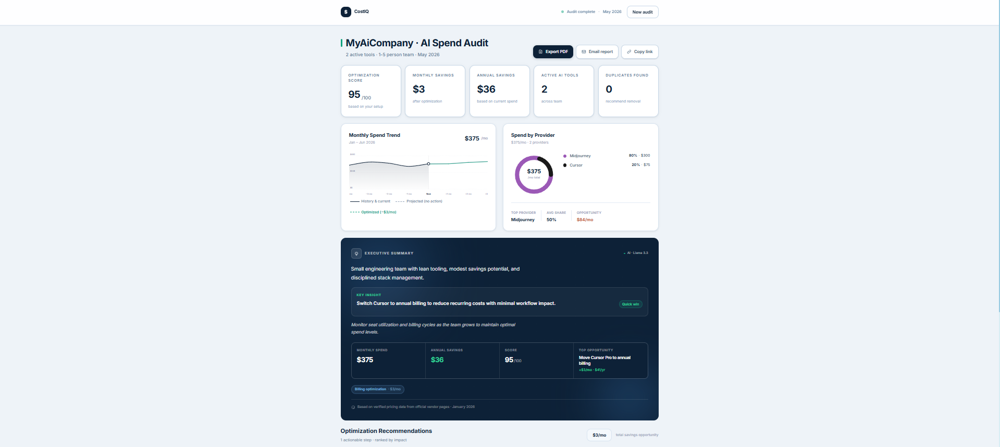

# CostIQ

> Find hidden AI costs. Save more. Spend smarter.

CostIQ is an AI spend auditing platform for startups and engineering teams. Enter your AI stack — ChatGPT, Claude, Cursor, Copilot, cloud AI — and get back a personalized report with savings recommendations, an optimization score, and a shareable link.

🔗 **Live demo:** [cost-iq-plum.vercel.app](https://cost-iq-plum.vercel.app/)


## What it looks like

**Sample audit report** — preview shown to visitors before they run their own.



**Real audit report** — generated after the user fills out the form.



## Features

- AI spend audit engine — 7 rules, every dollar traced to vendor pricing pages
- Personalized savings recommendations ranked by impact
- Optimization score (0–100) based on observable inefficiencies
- AI-generated executive summary (Groq + Llama 3.3)
- Shareable audit reports with public links
- Email delivery to inbox (Resend)
- Responsive UI with smooth animations

## Built with

- **Next.js 16** + App Router
- **React 19** + TypeScript
- **Tailwind CSS** v4
- **Framer Motion** for animations
- **Supabase** for report storage
- **Groq** for LLM summaries
- **Resend** for email delivery
- **Vitest** for unit tests

## Getting started

```bash
git clone https://github.com/ItsMeNikk/costiq.git
cd costiq
npm install
npm run dev
```

Then open <http://localhost:3000>.

## Scripts

```bash
npm run dev      # local dev server
npm run build    # production build
npm run lint     # eslint
npm test         # vitest (audit engine tests)
```

## Project docs

- [`ARCHITECTURE.md`](./ARCHITECTURE.md) — system diagram, data flow, scaling notes
- [`PRICING_DATA.md`](./PRICING_DATA.md) — every vendor price and source URL
- [`TESTS.md`](./TESTS.md) — what's tested and how to run it
- [`LANDING_COPY.md`](./LANDING_COPY.md) — production landing copy
- [`DEVLOG.md`](./DEVLOG.md) — daily build log

## License

MIT
